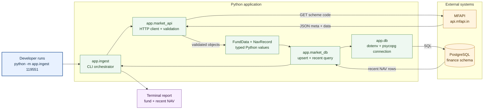
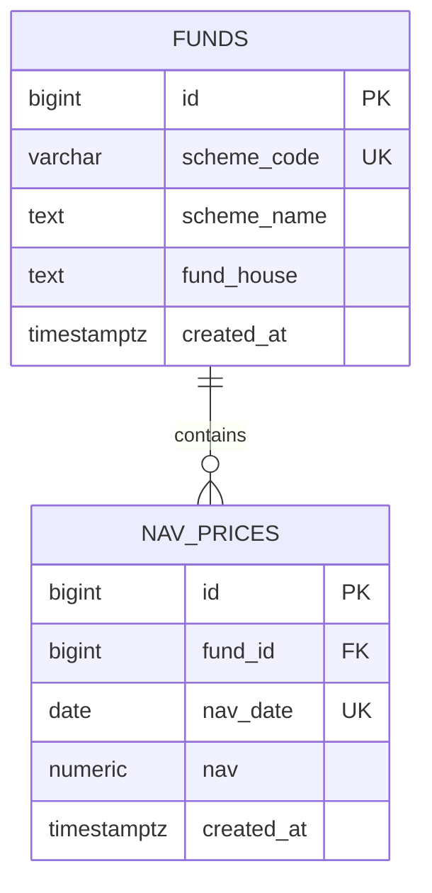

# Architecture

The tracker is a small command-line ingestion pipeline. It fetches one mutual fund's NAV history, validates and transforms the response, stores it in PostgreSQL, and prints a recent-history report.

## How the flow works

1. The user starts `app.ingest` with a mutual fund scheme code.
2. `app.market_api` calls MFAPI and validates the response status, metadata, dates, and NAV values.
3. The API response becomes typed `FundData` and `NavRecord` objects.
4. `app.market_db` upserts the fund and NAV history using the unique scheme code and `(fund_id, nav_date)` constraint.
5. The latest five NAV rows are queried and printed to the terminal.

## Database model

The application deliberately leaves the existing `finance.portfolio` table unchanged. Re-running ingestion updates existing records instead of creating duplicate fund or date rows.
